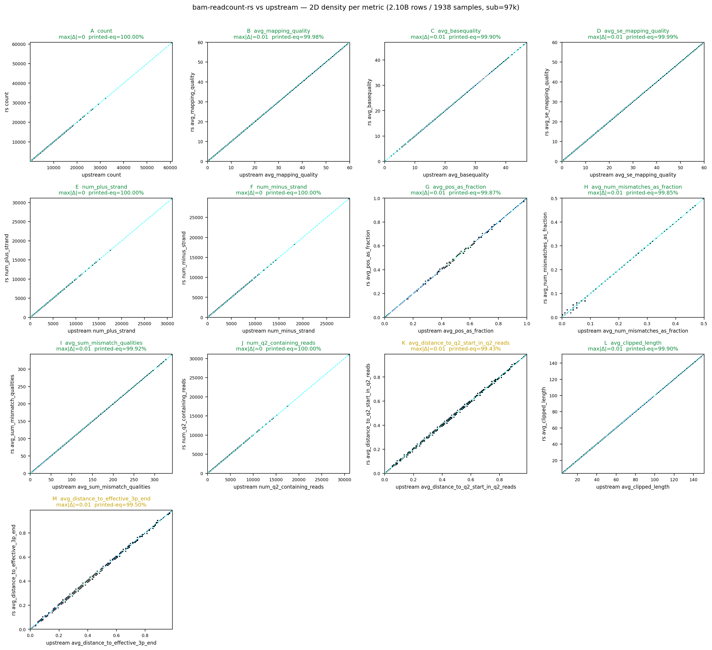
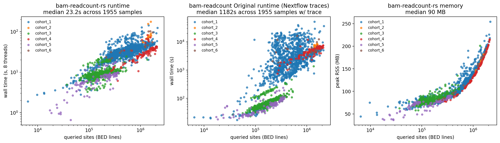
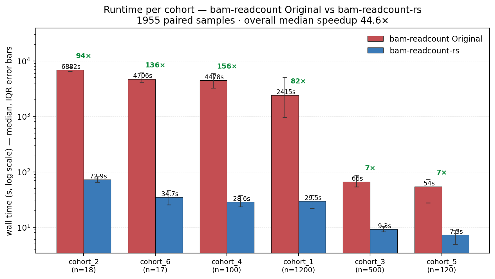

# bam-readcount-rs

A fast Rust reimplementation of [bam-readcount](https://github.com/genome/bam-readcount),
designed as a drop-in replacement inside the
[STREGA](https://github.com/theob0t/STREGA) variant-calling pipeline.

The output format reproduces the original `bam-readcount` v1.0.1 byte-for-byte
for the per-base SNV records that STREGA's `posLevel.read_bamReadCountsFile`
consumes (`STREGA/STREGA/posLevel.py:206`). All 13 metrics per base are
computed using the exact original formulas (see `src/metrics.rs`).

## Install

Build locally:

```bash
cargo build --release
# binary at: target/release/bam-readcount-rs
```

Or pull the published container:

```bash
apptainer pull --force bam-readcount-rs.sif \
    docker://ghcr.io/theob0t/bam-readcount-rs:latest
```

## Run

```bash
bam-readcount-rs --threads 8 --bgzf-threads 2 \
    -f reference.fasta \
    -l sites.bed \
    sample.bam \
    -o sample.bamReadCount.txt
```

Flags follow the original where they match (`-f`, `-l`, `-q`, `-b`, `-d`,
`-w`). `--threads` and `--bgzf-threads` are new — internal parallelism
replaces the per-chromosome subprocess fan-out STREGA's existing pipeline
uses (`scripts/bamreadscounts_parallel.py`). Workers × bgzf-threads should
equal the total CPU budget; with 8 / 2 a single sample finishes in ~23 s.

## Accuracy

Validated on **1938 samples × 2.10 B joined `(sample, position, base)` rows**
across 6 cohorts. For every position+base, both tools' outputs were joined
and compared row-by-row.

**All 13 metrics agree at the printed (`%.2f`) precision STREGA actually
reads from disk** — `pct_printed_eq ≥ 99.42 %` for every metric, integer
metrics are bit-identical at 100 %.

| metric | kind | %Δ=0 (full) | %printed-eq | max\|Δ\| | bias |
|---|---|---:|---:|---:|---:|
| count | int | 100.0000% | 100.0000% | 0 | 0 |
| num_plus_strand | int | 100.0000% | 100.0000% | 0 | 0 |
| num_minus_strand | int | 100.0000% | 100.0000% | 0 | 0 |
| num_q2_containing_reads | int | 100.0000% | 100.0000% | 0 | 0 |
| avg_mapping_quality | float | 99.9810% | 99.9804% | 0.01 | 7.98e-07 |
| avg_basequality | float | 99.9187% | 99.8978% | 0.01 | 9.82e-08 |
| avg_se_mapping_quality | float | 99.9983% | 99.9948% | 0.01 | 6.58e-08 |
| avg_pos_as_fraction | float | 99.9277% | 99.8689% | 0.01 | 5.32e-07 |
| avg_num_mismatches_as_fraction | float | 99.9298% | 99.8514% | 0.01 | 7.21e-07 |
| avg_sum_mismatch_qualities | float | 99.9216% | 99.9164% | 0.01 | -1.15e-07 |
| avg_distance_to_q2_start_in_q2_reads | float | 99.7910% | 99.4252% | 0.01 | -2.12e-06 |
| avg_clipped_length | float | 99.9190% | 99.8989% | 0.01 | 1.08e-07 |
| avg_distance_to_effective_3p_end | float | 99.7805% | 99.4995% | 0.01 | -2.57e-06 |

- **%Δ=0** — fraction of rows where the two implementations produce the
  bit-identical float value across the full 2.10 B-row population.
- **%printed-eq** — fraction where both round to the same `%.2f` string.
  This is what STREGA actually reads.
- **max\|Δ\|** — worst-case absolute deviation across all rows. The `0.01`
  ceiling is the printf-rounding boundary (e.g. one side rounds 0.0049 →
  0.00, the other 0.0051 → 0.01); never larger.
- **bias** — mean signed Δ across the full population. All 1e-6 or smaller,
  meaning no systematic offset.

Per-metric concordance (2D density per metric — point clouds tight around
y = x for every metric):



## Performance

Median across 1955 samples: **~23 s wall** at 8 threads, **~90 MB peak RSS**.
Original `bam-readcount` median on the same samples: ~1180 s.



The middle panel is the original `bam-readcount` wall time recovered from
the STREGA Nextflow trace files for the same samples — the per-task
`realtime` of `VARIANT_ANALYSIS:BAM_READCOUNTS`, which is the parallel
wrapper's wall time across its 22 chromosome subprocesses (not
single-process original).

Per-cohort head-to-head (median, IQR error bars, log-y):



Median speedup is **44.6×** on the 1955-sample paired set. Cohorts with
deep coverage (cohorts 1, 2, 4, 6) hit 80–160×; smaller-BED cohorts
(cohorts 3, 5) sit around 7× because the original tool's per-task overhead
dominates anyway. Cohort labels are anonymized to `cohort_1..cohort_6`
since the underlying sample IDs are access-controlled.

## Limitations (v1)

- SNV per-base records only (`A`, `C`, `G`, `T`, `N`, `=`). Indel rows
  (`+SEQ` / `-SEQ`) are not emitted — `posLevel.py` does not consume them.
- `--per-library`, `--insertion-centric`, `--print-individual-mapq` modes
  not implemented.
- Output is sorted by (chrom, pos); the original emits in BED-input order.
  Add a `--preserve-bed-order` flag if needed.

## Benchmark methodology

The benchmark runs the tool against each sample on a SLURM array, capturing
wall time and peak RSS via `/usr/bin/time`. The reference for accuracy is
the original `<sample>.bamReadCount.txt` already present in each sample's
`stregaOuts/` directory, so the original `bam-readcount` is not re-executed.
Once the array completes, an aggregator joins the two outputs on
`(sample, chrom, pos, base)` and emits per-feature parity tables, per-sample
runtime/RSS, and the plots under `bench/results/<runid>/`. The sample list
itself is not published — cohort data is access-controlled.

### Caveats

A few things worth knowing about the join semantics, because the raw row
counts can be misleading if you don't:

1. **Per-position coverage is 1:1, not partial.** Across the 1955-sample
   run, the unique `(chrom, pos)` set produced by `bam-readcount-rs` is
   identical to the original's in every sample we spot-checked —
   `pos_diff = 0`. `bam-readcount-rs` emits exactly one row per unique
   position; the original emits one row per `(BED-interval, position)`
   pair. So when raw line counts diverge (typically ref ~5–6% larger),
   it's *the original duplicating rows*, not `bam-readcount-rs` dropping
   coverage. Per-base differences <1 % of rows.

2. **The original emits duplicate position rows when BED intervals
   overlap.** For a position `X` covered by two overlapping intervals in
   the input BED, the original emits `X` twice — byte-identical rows,
   since the underlying pile-up is the same. The STREGA pipeline that
   produced our reference `<sample>.bamReadCount.txt` files passes a BED
   with overlaps, so this happens at most positions: 1910 / 1955 samples
   (97.7 %) had `joined > rs_lines` from this duplication alone. The
   benchmark parser (`bench/parse_all.py`) deduplicates ref-side rows by
   `(chrom, pos, base)` before joining.

3. **Sample manifest dedup.** `bench/samples.tsv` (gitignored) originally
   listed 1962 rows but only 1955 unique `sample_id`s — 7 samples
   appeared in two cohort assignments with identical bam/bed paths. Both
   array tasks wrote to the same `raw/<sample_id>/` directory, so output
   was byte-identical, not silently lost. The manifest is now deduped to
   1955 rows so the published count matches the unique sample count.

4. **17 samples excluded — original output was generated against an
   N-masked reference fasta.** During the 2000-sample run we found
   265,638 rows (≈0.011 % of 2.32 B) where
   `ref_avg_sum_mismatch_qualities = 0` but `rs_avg_sum_mismatch_qualities > 0`.
   The reverse never happens. Every one of those rows came from one of
   17 specific samples (the other 1938 were exact). At each affected
   position the original output's column-3 reference base is `N`, while
   rs reads the same position from the GATK-bundle hg38
   (`Homo_sapiens_assembly38.fasta`) and gets the actual base — confirmed
   via `samtools faidx`. When `bam-readcount` sees `N` at a position, it
   cannot decide which read bases are mismatches, so it emits `0` for
   `avg_sum_mismatch_qualities` at every per-base entry of that position.
   The conclusion is that the `<sample>.bamReadCount.txt` files for
   these 17 samples were produced by a STREGA pipeline run that received
   an N-masked reference fasta for one or two chromosomes; the BAMs
   themselves are clean (CIGAR / MD / NM are all internally consistent).
   The IDs are listed in `bench/excluded_samples.txt` (gitignored —
   cohort metadata is access-controlled) and skipped by `parse_all.py` at
   parse time.
