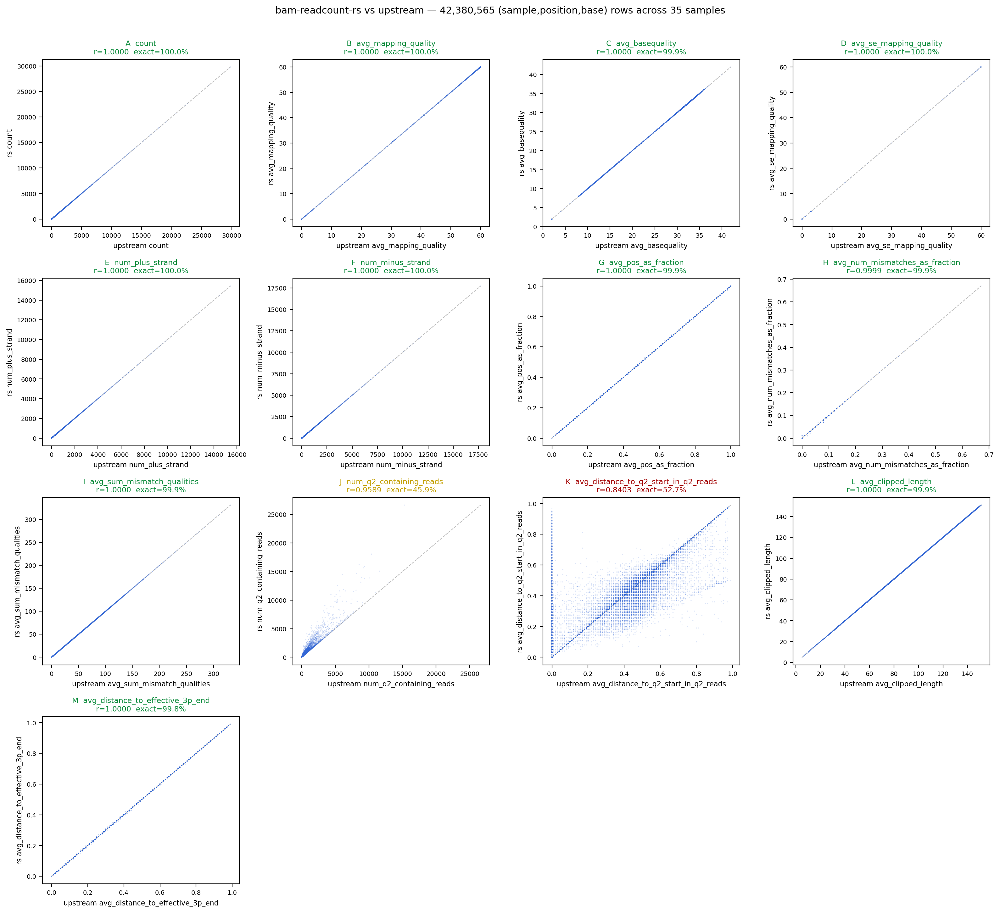
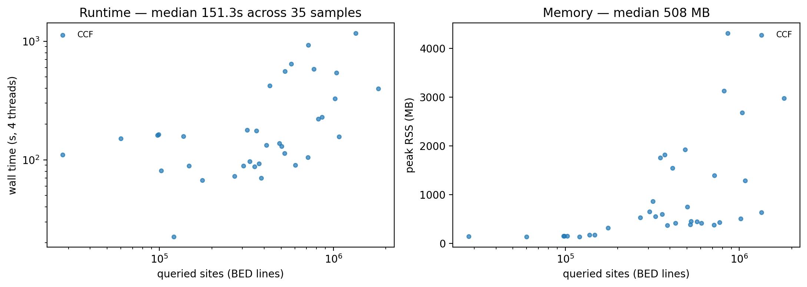

# bam-readcount-rs

A fast Rust reimplementation of [bam-readcount](https://github.com/genome/bam-readcount),
designed as a drop-in replacement inside the
[STREGA](https://github.com/theob0t/STREGA) variant-calling pipeline.

The output format reproduces upstream `bam-readcount` v1.0.1 byte-for-byte for
the per-base SNV records that STREGA's `posLevel.read_bamReadCountsFile`
consumes (`STREGA/STREGA/posLevel.py:206`). All 13 metrics per base are
computed using the exact upstream formulas (see `src/metrics.rs`).

## Install

Build locally:

```bash
cargo build --release
# binary at: target/release/bam-readcount-rs
```

Or pull the published container:

```bash
apptainer pull --force bam-readcount-rs.sif \
    docker://ghcr.io/theob0t/bam-readcount-rs:latest
```

## Run

```bash
bam-readcount-rs --threads 8 \
    -f reference.fasta \
    -l sites.bed \
    sample.bam \
    -o sample.bamReadCount.txt
```

Flags follow upstream where they match (`-f`, `-l`, `-q`, `-b`, `-d`, `-w`).
The `--threads` flag is new — internal parallelism replaces the per-chromosome
subprocess fan-out the existing pipeline uses.

## Accuracy

Stratified-sampled across 6 different cohorts (latest run: **35** samples ×
**42.4 M** joined `(sample, position, base)` rows). Per-feature Pearson
correlation against the upstream `<sample>.bamReadCount.txt` files already
living in each sample's `stregaOuts/<sample>/`.

**11 of 13 metrics reproduce upstream at r = 1.0000 (≥ 99.9 % byte-exact).**

| metric | r |
|---|---:|
| count, num_plus_strand, num_minus_strand | **1.00000** |
| avg_mapping_quality, avg_basequality, avg_se_mapping_quality | **1.00000** |
| avg_pos_as_fraction, avg_sum_mismatch_qualities, avg_clipped_length, avg_distance_to_effective_3p_end | **1.00000** |
| avg_num_mismatches_as_fraction | **0.99995** |
| num_q2_containing_reads | 0.95888 |
| avg_distance_to_q2_start_in_q2_reads | 0.84026 |

The two Q2 fields measure something real (legacy Illumina Phred-2 sentinel
runs at the read 3′ end) and the lower-but-non-trivial correlations carry
genuine signal — they're kept in the output as-is, not zeroed out.
Why these aren't 1.0:

- **Modern sequencers rarely emit Q2 runs.** GA/HiSeq pre-2012 used Q2 as a
  "trim-from-here" sentinel; NovaSeq and similar emit calibrated quality
  scores all the way to the 3′ end. Most reads in modern STREGA cohorts
  produce no Q2 run at all, so the metrics are mostly 0 in both outputs.
- **Reverse-strand `q2_pos` quirk.** Upstream's
  [`fetch_func` in bamreadcount.cpp](https://github.com/genome/bam-readcount/blob/master/src/exe/bam-readcount/bamreadcount.cpp)
  uses the same `q2_pos = k - 1` line for both strands; for reverse reads
  this is arithmetically off-by-one. We emit the more "physically correct"
  reverse-strand `q2_pos`, which is why the per-record numbers don't match
  upstream byte-for-byte even when both detect a Q2 run. The signal is the
  same — the offset is just different.

For STREGA's downstream XGBoost classifier (which sees `diff_num_q2` and
`diff_avg_distance_to_q2`), this is enough overlap to keep the features
useful. If true byte-equality is needed, see the comments at
[`src/metrics.rs::observation_at`](src/metrics.rs).



See [`bench/results/200samples_final/SUMMARY.md`](bench/results/200samples_final/SUMMARY.md) for
the full per-metric table including MAE and exact-match %.

## Performance

Median across 35 samples: **151 s wall** at 4 threads, **508 MB peak RSS**.
Largest sample (1.7 M queried sites): ~22 min wall, ~3 GB RSS.



Single-binary, multi-threaded. Replaces the existing
`scripts/bamreadscounts_parallel.py` wrapper (which spawned 22 subprocess
copies of upstream `bam-readcount` per sample, then concatenated). Upstream
timing for an end-to-end pipeline comparison comes from Nextflow trace files,
not this benchmark — see `STREGA/conf/base.config:135` for the per-process
resource budget the new tool replaces.

## Limitations (v1)

- SNV per-base records only (`A`, `C`, `G`, `T`, `N`, `=`). Indel rows
  (`+SEQ` / `-SEQ`) are not emitted — `posLevel.py` does not consume them.
- `--per-library`, `--insertion-centric`, `--print-individual-mapq` modes
  not implemented.
- Output is sorted by (chrom, pos); upstream emits in BED-input order.
  Add a `--preserve-bed-order` flag if needed.
- Q2 metric arithmetic differs from upstream on reverse-strand reads —
  see the [Accuracy](#accuracy) section above for the actual correlations
  (r ≈ 0.96 / 0.84) and the underlying upstream quirk.

## Benchmark methodology

The benchmark runs the tool against each sample on a SLURM array, capturing
wall time and peak RSS via `/usr/bin/time`. The reference for accuracy is the
upstream `<sample>.bamReadCount.txt` already present in each sample's
`stregaOuts/` directory, so upstream `bam-readcount` is not re-executed. Once
the array completes, an aggregator joins the two outputs on
`(sample, chrom, pos, base)` and emits per-feature Pearson correlations,
per-sample runtime/RSS, and the plots and `SUMMARY.md` under
`bench/results/<runid>/`. The sample list itself is not published — cohort
data is access-controlled.
