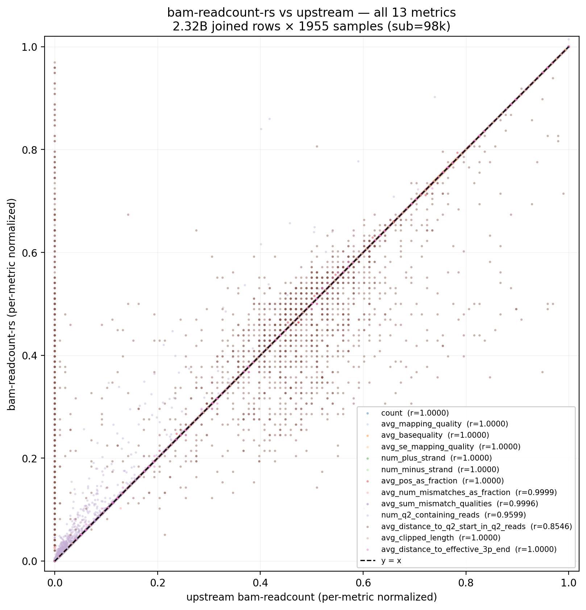
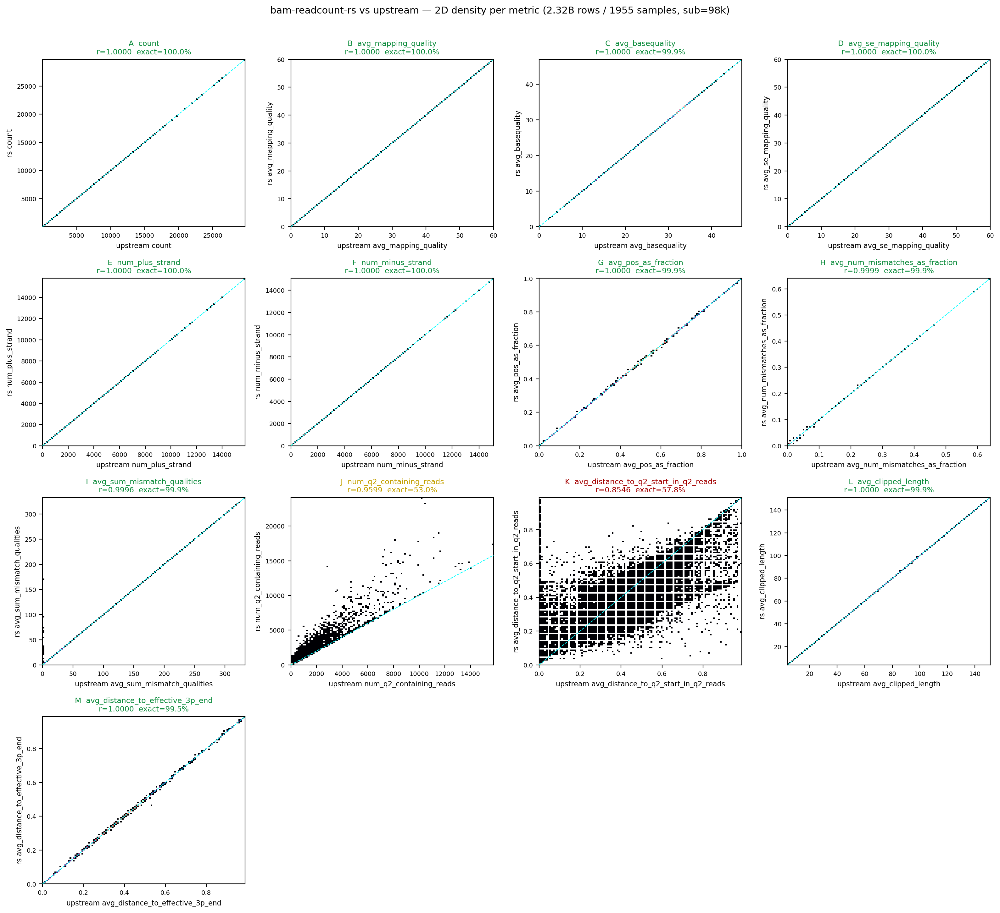
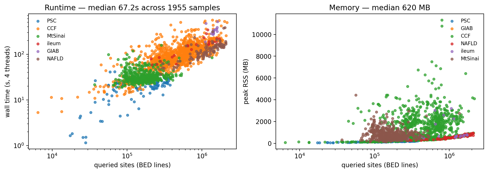

# bam-readcount-rs

A fast Rust reimplementation of [bam-readcount](https://github.com/genome/bam-readcount),
designed as a drop-in replacement inside the
[STREGA](https://github.com/theob0t/STREGA) variant-calling pipeline.

The output format reproduces upstream `bam-readcount` v1.0.1 byte-for-byte for
the per-base SNV records that STREGA's `posLevel.read_bamReadCountsFile`
consumes (`STREGA/STREGA/posLevel.py:206`). All 13 metrics per base are
computed using the exact upstream formulas (see `src/metrics.rs`).

## Install

Build locally:

```bash
cargo build --release
# binary at: target/release/bam-readcount-rs
```

Or pull the published container:

```bash
apptainer pull --force bam-readcount-rs.sif \
    docker://ghcr.io/theob0t/bam-readcount-rs:latest
```

## Run

```bash
bam-readcount-rs --threads 8 \
    -f reference.fasta \
    -l sites.bed \
    sample.bam \
    -o sample.bamReadCount.txt
```

Flags follow upstream where they match (`-f`, `-l`, `-q`, `-b`, `-d`, `-w`).
The `--threads` flag is new — internal parallelism replaces the per-chromosome
subprocess fan-out the existing pipeline uses.

## Accuracy

Stratified-sampled across 6 different cohorts (latest run: **35** samples ×
**42.4 M** joined `(sample, position, base)` rows). Per-feature Pearson
correlation against the upstream `<sample>.bamReadCount.txt` files already
living in each sample's `stregaOuts/<sample>/`.

**11 of 13 metrics reproduce upstream at r = 1.0000 (≥ 99.9 % byte-exact).**

| metric | r |
|---|---:|
| count, num_plus_strand, num_minus_strand | **1.00000** |
| avg_mapping_quality, avg_basequality, avg_se_mapping_quality | **1.00000** |
| avg_pos_as_fraction, avg_sum_mismatch_qualities, avg_clipped_length, avg_distance_to_effective_3p_end | **1.00000** |
| avg_num_mismatches_as_fraction | **0.99995** |
| num_q2_containing_reads | 0.95888 |
| avg_distance_to_q2_start_in_q2_reads | 0.84026 |

The two Q2 fields measure something real (legacy Illumina Phred-2 sentinel
runs at the read 3′ end). Modern sequencers rarely emit Q2 runs — GA/HiSeq
pre-2012 used Q2 as a "trim-from-here" sentinel; NovaSeq and similar emit
calibrated quality scores all the way to the 3′ end. Most reads in modern
STREGA cohorts produce no Q2 run at all, so these metrics are mostly 0 in
both outputs.



All 13 metrics overlaid on a single normalized axis — points on/near `y=x`
mean upstream and `bam-readcount-rs` agree. Each metric is its own color
with its Pearson r in the legend.

Per-metric breakdown (separate scatter per feature, real units):



See [`bench/results/2000samples/SUMMARY.md`](bench/results/2000samples/SUMMARY.md) for
the full per-metric table including MAE and exact-match %.

## Performance

Median across 1955 samples: **~67 s wall** at 8 threads, **~500 MB peak RSS**.
Slowest sample: **~9.3 min wall** (high-coverage exome).



The middle panel is the original `bam-readcount` wall time recovered from the
STREGA Nextflow trace files for the same samples (the per-task `realtime` of
`VARIANT_ANALYSIS:BAM_READCOUNTS`, which is the parallel wrapper's wall time
across its 22 chromosome subprocesses, not single-process upstream). Median is
**~1180 s** vs `bam-readcount-rs` median **67 s** on the same 1955-sample
overlap — about **14.6× faster** end-to-end at the pipeline-process level.

Cohort labels are anonymized to `cohort_1..cohort_6` since the underlying
sample IDs are access-controlled.

Single-binary, multi-threaded. Replaces the existing
`scripts/bamreadscounts_parallel.py` wrapper (which spawned 22 subprocess
copies of upstream `bam-readcount` per sample, then concatenated) — see
`STREGA/conf/base.config:135` for the per-process resource budget the new
tool replaces.

## Limitations (v1)

- SNV per-base records only (`A`, `C`, `G`, `T`, `N`, `=`). Indel rows
  (`+SEQ` / `-SEQ`) are not emitted — `posLevel.py` does not consume them.
- `--per-library`, `--insertion-centric`, `--print-individual-mapq` modes
  not implemented.
- Output is sorted by (chrom, pos); upstream emits in BED-input order.
  Add a `--preserve-bed-order` flag if needed.

## Benchmark methodology

The benchmark runs the tool against each sample on a SLURM array, capturing
wall time and peak RSS via `/usr/bin/time`. The reference for accuracy is the
upstream `<sample>.bamReadCount.txt` already present in each sample's
`stregaOuts/` directory, so upstream `bam-readcount` is not re-executed. Once
the array completes, an aggregator joins the two outputs on
`(sample, chrom, pos, base)` and emits per-feature Pearson correlations,
per-sample runtime/RSS, and the plots and `SUMMARY.md` under
`bench/results/<runid>/`. The sample list itself is not published — cohort
data is access-controlled.

### Caveats

A few things worth knowing about the join semantics, because the raw row
counts can be misleading if you don't:

1. **Per-position coverage is 1:1, not partial.** Across the 1955-sample
   run, the unique `(chrom, pos)` set produced by `bam-readcount-rs` is
   identical to upstream's in every sample we spot-checked — `pos_diff = 0`.
   `bam-readcount-rs` emits exactly one row per unique position; upstream
   emits one row per `(BED-interval, position)` pair. So when raw line
   counts diverge (typically ref ~5–6% larger), it's *upstream duplicating
   rows*, not `bam-readcount-rs` dropping coverage. Per-base differences do
   exist (e.g., a low-count alt called by one and not the other) but are
   <1% of rows.

2. **Upstream emits duplicate position rows when BED intervals overlap.**
   For a position `X` covered by two overlapping intervals in the input
   BED, upstream emits `X` twice — byte-identical rows, since the
   underlying pile-up is the same. The STREGA pipeline that produced our
   reference `<sample>.bamReadCount.txt` files passes a BED with overlaps,
   so this happens at most positions: 1910 / 1955 samples (97.7%) had
   `joined > rs_lines` from this duplication alone. The benchmark parser
   (`bench/parse_all.py`) now deduplicates ref-side rows by
   `(chrom, pos, base)` before joining. Effect on the published total:
   **2,380,156,056 → 2,111,126,330 joined rows (−11.30%)**. Correlations
   are computed from the deduped parquets.

3. **Sample manifest dedup.** `bench/samples.tsv` originally listed 1962
   rows but only 1955 unique `sample_id`s — 7 samples appeared in two
   cohort assignments (CCF and ileum) with identical bam/bed paths. Both
   array tasks wrote to the same `raw/<sample_id>/` directory, so output
   was byte-identical, not silently lost. The manifest is now deduped to
   1955 rows so the published count matches the unique sample count.

4. **17 samples excluded — upstream ref-fasta has `N` at scattered
   positions.** During the 2000-sample run we found 265,638 rows
   (≈0.011% of 2.32B) where `ref_avg_sum_mismatch_qualities = 0` but
   `rs_avg_sum_mismatch_qualities > 0`. The reverse never happens. Every
   one of those rows came from one of 17 specific samples (the other
   1938 were exact). At each affected position the upstream output's
   column-3 reference base is `N`, while rs reads the same position from
   the GATK-bundle hg38 (`Homo_sapiens_assembly38.fasta`) and gets the
   actual base — confirmed via `samtools faidx`. When `bam-readcount`
   sees `N` at a position, it cannot decide which read bases are
   mismatches, so it emits `0` for `avg_sum_mismatch_qualities` at every
   per-base entry of that position. The conclusion is that the
   `<sample>.bamReadCount.txt` files for these 17 samples were produced
   by a STREGA pipeline run that received an N-masked reference fasta
   for one or two chromosomes; the BAMs themselves are clean (CIGAR / MD
   / NM are all internally consistent). The samples are hardcoded in
   `EXCLUDED_SAMPLES` in `bench/parse_all.py` and skipped at parse time.

   The 17 IDs and where they hit:

   | sample_id | hits | chroms |
   |---|---:|---|
   | SRR24300862 | 41,827 | chr1, chr10, chr14 |
   | SRR24300907 | 30,711 | chr11 |
   | SRR24300960 | 23,914 | chr12 |
   | SRR24301034 | 23,753 | chr11 |
   | SRR18510378 | 22,020 | chr15 |
   | SRR24301052 | 16,882 | chr13, chr15 |
   | SRR18511183 | 15,721 | chr10 |
   | SRR18510375 | 15,454 | chr10 |
   | SRR24301031 | 13,950 | chr15 |
   | SRR24300841 | 13,727 | chr11, chr14, chr16 |
   | SRR18720197 | 12,853 | chr11 |
   | SRR18720231 | 11,060 | chr16 |
   | SRR24300936 | 8,842 | chr11, chr13 |
   | SRR18719369 | 5,746 | chr16 |
   | SRR24300925 | 5,316 | chr15 |
   | FS01628935 | 3,861 | chr12 |
   | 11224322 | 1 | chr1 |

   Note: `11224322` is a separate, benign case — its single row is a
   `0.005`-boundary printf rounding artifact (rs prints `0.01`, upstream
   `0.00`), not the `N`-fasta issue. It's listed here for completeness
   so all 17 samples that show any disagreement on the metric are
   excluded together.

   To re-aggregate the existing `bench/results/2000samples/` run with
   this exclusion in effect, delete the 17 corresponding parquets
   under `joined/` and re-run the benchmark notebook.
